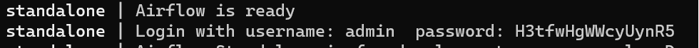
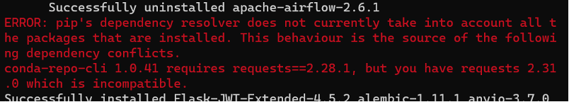
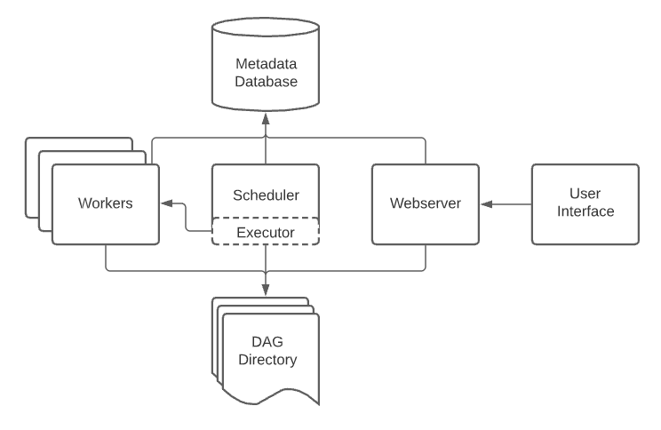
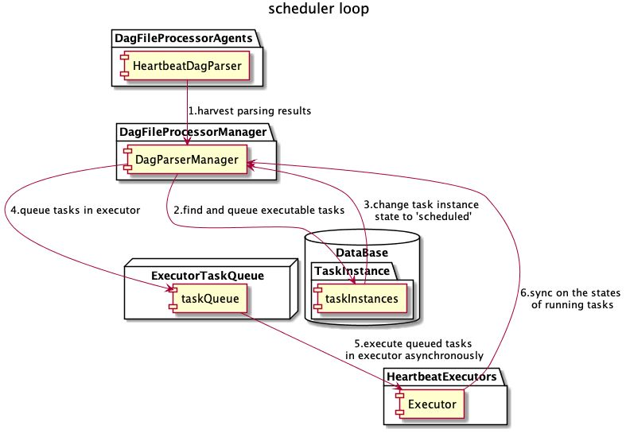
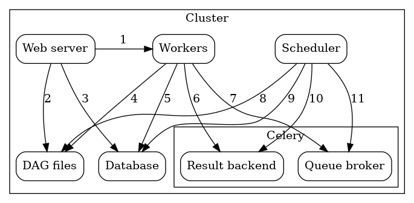

### First, let me briefly describe the installation process.
1. Require a Python 3 environment, until **Python 3.10**.
2. Require a home directory.
```bash
mkdir ~/airflow
```
3. Set the environment variable.
```bash
export AIRFLOW_HOME=~/airflow
```
4. Type in the following command at the terminal.
```bash
AIRFLOW_VERSION=2.6.2
PYTHON_VERSION="$(python --version | cut -d " " -f 2 | cut -d "." -f 1-2)"
CONSTRAINT_URL="https://raw.githubusercontent.com/apache/airflow/constraints-${AIRFLOW_VERSION}/constraints-${PYTHON_VERSION}.txt"
pip install "apache-airflow==${AIRFLOW_VERSION}" --constraint "${CONSTRAINT_URL}"
```
5. Run airflow.
```bash
airflow standalone
```
6. Then will get the “user” and the “password” at the terminal.
   
7. Enjoy it.

##### Others, if get an error, don’t be afraid. Like this, just because the dependence’s version.

```bash
pip uninstall -y requests
pip install requests==2.28.1
```

# Now let's get started with Airflow


### 1. Airflow framework
   1. Basic
   - **Scheduler**: It processes the planned workflow and submits the task to the Executor to run.<br>
   - **Executor**: Handle running tasks. In the default Airflow installation, it runs in the Scheduler, but most Production-Environment Executors actually push job execution to Workers.<br>
   - **Webserver**: It provides a convenient user interface to execute, debug the DAGs and tasks.<br>
   - **DAG Directory**: It’s read by Scheduler and Executor(Worker).<br>
   - **Metadata Database**: Used by Scheduler, Executor, and Webserver to save state.

### 2. Scheduler
   1. Basic
   - **JOB**: The top-level job. There are *<ins>SchedulerJob</ins>*, *<ins>BackfillJob</ins>*, and *<ins>LocalTaskJob</ins>*. SchedulerJob is created by Scheduler, BackfillJob is created by Backfill, LocalTaskJob is created from the previous two types of jobs.
   - **DAG**: Directed acyclic graph, use to represent a workflow.
   - **DAG Run**: A workflow instance that represents a run (state) of a workflow.
   - **Task**: The basic building blocks of a workflow.
   - **Task Instance**: A task instance that represents a run (state) of a task.
   2. Heartbeat
   
      In airflow, heartbeat is an important concept, a heartbeat is not simply a "heartbeat". Heartbeat is a way for components in airflow to collaborate, communicate, interact, and work. In shceduler, there are several important heatbeats.

      | heartbeat  | effect |
      | ------------- | ------------- |
      | scheduler -> executor  | triggers the running task, and update the task state  |
      | scheduler -> DagFileProcessorAgent  | check the DagFileProcessorManager's alive status, and process the messages returned by manager  |
      | scheduler -> scheduler  | check the scheduler for problems, update the schedulerjob database information  |


   3. Functional logic
   
      The scheduler is actually a "airflow.jobs.SchedulerJob" instance's run method. Job.run() adds information about itself to the job table at the beginning, and maintain state and heartbeat, and also update the end-time to the table. Butit's often interrupted by an exception, end-time is empty. No matter how the exit is, when SchedulerJob exits, it kills all sub-processes.
      
      Here is a brief description of the functional logic of the Scheduler:
      - Iterate over all dags in the DAGs path, start a number of processes (process pools), and assign a dag file to each process. Each DagFileProcessor parses the dag file assigned to it and creates DagRuns and TaskInstance in DB based on the parsed result.
      - In the scheduler_loop, check the status of TaskInstance associated with the active DagRun, resolve any dependencies between TaskInstance, identify TaskInstance that needs to be executed, and add them to the executor queue. Update the newly arranged TaskInstance state to the QUEUED state.
      - Each available Executor takes a TaskInstance from the queue and starts executing it, updating the database record for this TaskInstance to SCHEDULED.
      - When a TaskInstance finishes running, the associated Executor reports to the queue and updates the TaskInstance status in the database ("Done", "failed", etc.)
      - Once all the DAGs have been processed, the next round of the loop is processed. Another detail here is that the processing time of a DAG in the previous round may be so long that the DAG is not finished in the next round. Airflow's processing logic is to not create a process for this DAG in this round, so as not to block the process from processing the rest of the DAG.


   4. Initiator
   
         When the scheduler is started, it's started through the airflow/__main__.py entry method by passing the parameter "scheduler". When it's started, the job object is created, the core logic begins after executing the job.run() method.

      1. Print the log: "Starting the scheduler", indicating the start.
      2. Start the DagFileProcessorAgent
            - Scan the file and import the module
            - Search DAGs in the DAG folder
            - Create dagrun
            - Create task instances
      3. Enter the run_scheduler_loop method of the core and call it in a loop
            - The DAG parsing result is obtained through the DagFileProcessorAgent
            - Find and queue executable tasks
               1. Change the TaskInstance state in the database
               2. Queue tasks in the executor
            - Heartbeat detection executor
               1. Execute the tasks queued in the executor asynchronously
               2. Synchronize the state of running tasks
      4. Execute do_scheduling, DAG scheduling decisions, TaskInstance state management, task synchronization to executors, and more
      5. Enable heartbeat check
            - Executor heartbeat
            - DagFileProcessorAgent heartbeat
            - Scheduler heartbeat

### 3. Executor
Airflow is a comprehensive platform with multiple components, so there are multiple options to choose from when using it. For example, the most critical Executors have four options

   - **SequentialExecutor**: Single-process sequential execution of tasks, default executor, usually used only for testing
   - **LocalExecutor**: Multiple processes perform tasks locally
   - **CeleryExecutor**: Distributed scheduling, commonly used in production
   - **DaskExecutor**: Dynamic task scheduling, mainly used for data analysis

   1. CeleryExecutor
      1.  Architecture
         
             - **Worker**: Performs the assigned tasks
             - **Scheduler**: Responsible for adding the tasks to the queue
             - **Web Server**: HTTP server provides access to DAG tasks's status information
             - **Database**: Contains information about the state of tasks, DAGs, etc.
             - **Celery**: queue
                  1. Broker: Stores commands to execute
                  2. Result backend: Stores the status of the completed command

      Components communicate with each other in many places.
         1. **Web server --> Workers**: Get the task execution log
         2. **Web server --> DAG files**: Show the DAG structure
         3. **Web server --> Database**: Get the task state
         4. **Workers --> DAG files**: Parse the DAG structure and execute the task
         5. **Workers --> Database**: Get and store the connection configuration and variables
         6. **Workers --> Celery's result backend**: Store the state of the task
         7. **Workers --> Celery's broker**: Store the command to execute
         8. **Scheduler --> DAG files**: Parse the DAG structure and execute the task
         9. **Scheduler --> Database**: Store DAGruns and related tasks
         10. **Scheduler --> Celery's result backend**: Get information about the tasks that have been executed
         11. **Scheduler --> Celery's broker**: Put the command to execute

#The process of executing the task is too complex 

#Next to be continued