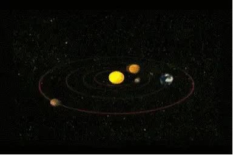

# What is the Airflow？

Airflow is a programmable, scheduled and monitored workflow platform.

Airflow provides rich commands and WebUI for easy management and monitoring.

Users can define a set of dependent Directed Acyclic Graph (DAG) tasks to be executed sequentially.

and then,

### What is the Directed Acyclic Graph (DAG  /ˈdæɡ/)？

In fact, I don't know how to introduce DAG, but I can show you a picture.

This is the solar system, many planets move around the sun, but this picture is a “Cyclic Graph”, which misleads many people.

In fact, the planets in the solar system operate according to the DAG (Directed Acyclic Graph) mode, like the next picture.

In simple terms, this is a DAG.

Back to Airflow topic, before I use it, the simplest workflow is actually crontab.

Compared with Airflow, crontab has many shortcomings,

For example,
1. Difficult to handle task dependencies(de-pen-den-cies).
2. It is inconvenient(in-con-ve-ni-ent) to check the progress.
3. No automatic retry and alarm.
4. Without logs, it is difficult to view task execution time and historical(his-tor-i-cal) records, and cannot be optimized(op-ti-mized) accordingly.

